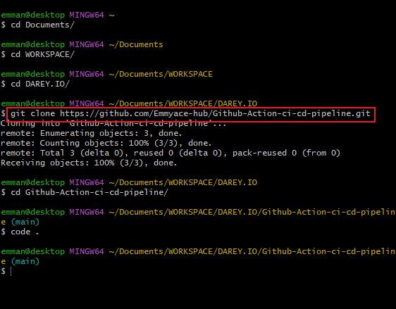
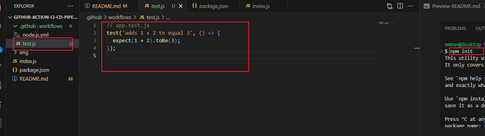
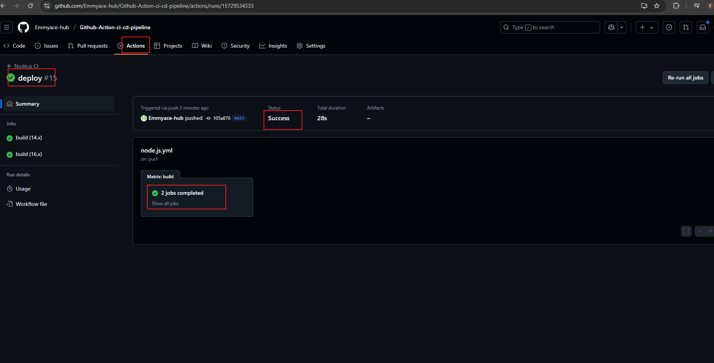

# Github-Action-ci-cd-pipeline

# Setting Up the Project: 

* Creating a GitHub repository "Github-Action-ci-cd-pipeline" and clone it into the local repository using the command:
    
      git clone https://github.com/Emmyace-hub/Github-Action-ci-cd-pipeline.git

* Create a simple Node.js "index.js" Application and input the script below
 run the command "npm init"  to initialize a Node.js project 

      // index.js
      const express = require('express');
      const app = express();
      const port = process.env.PORT || 3000;

      app.get('/', (req, res) => {
        res.send('Hello World!');
      });

      app.listen(port, () => {
       console.log(`App listening at http://localhost:${port}`);
      });

# Writing a CI Workflow: 
A sample GitHub Actions workflow file automates testing and deployment.
we set up a Github Action workflow and create a file "node.js.yml" in it which contains the script to automate testing across different node.js version

# Deployment and Experimentation:

 * Adding automated tests into the worflow and inputting the test script below :

        name: test

        on:
       pull_request:
       branches:
       - main

        jobs:
       test:
       runs-on: ubuntu-latest
        container:
        image: node:20

        steps:
         - uses: actions/checkout@v3

        - name: Install dependencies
        run: npm install

        - name: Run tests
        run: npm test

        - name: Build project
        run: npm run build

 
 

 * Addy deploy into the workflow with the script

        name: Deploy Application

         on:
        push:
        branches:
        - main

        jobs:
        deploy:
        runs-on: ubuntu-latest

        steps:
         - name: Checkout code
         uses: actions/checkout@v4

        # Add build steps here if needed
        # - name: Build
        #   run: echo "Build your app here"

        - name: Deploy to Server
           run: |
            echo "Deploying application..."
           # Add your deployment commands here
           # For example, scp files or use rsync, or call a deploy script

